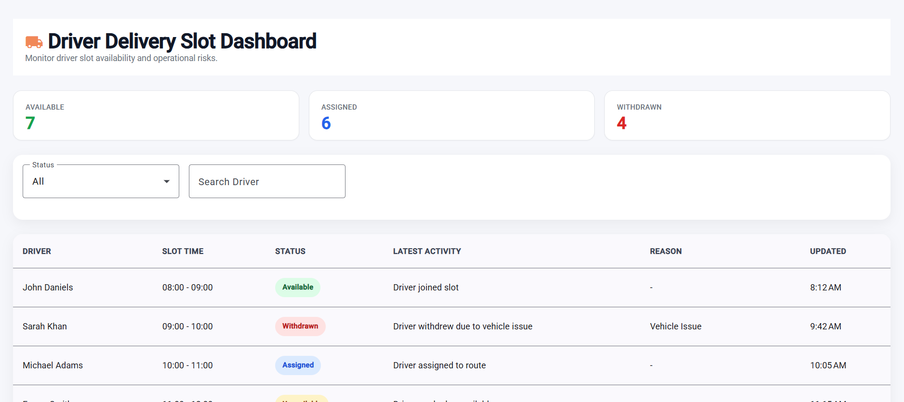

# 🚚 Driver Delivery Slot Dashboard

A modern Angular-based operational dashboard used to monitor **driver availability, slot assignments, and withdrawal activity** in real time. Built for operations teams to quickly identify delivery capacity and risks.

---

## 🚀 Features

- 📊 Real-time driver slot monitoring
- 🟢 Status tracking (Available / Assigned / Withdrawn / Unavailable)
- 📈 KPI summary cards (live counts)
- 🔍 Search + filtering by driver and status
- 📅 Slot-based scheduling view
- ⚡ Mock API integration with simulated delay
- 🎨 Clean, modern Angular Material UI

---

## 🧱 Tech Stack

- Angular 21 (Standalone Components)
- Angular Material
- RxJS
- TypeScript
- SCSS
- HttpClient (mock JSON API)

---

## 📦 Project Setup

### 1. Install dependencies

```bash
npm install
```
2. Run development server

```bash
ng serve
```
Then open:
http://localhost:4200/
The application will automatically reload when you modify source files.

```bash
🧪 Running Tests
Unit tests
```
Runs unit tests using the Angular test runner.

📁 Project Structure
```bash
src/
│
├── app/
│   ├── components/
│   │   └── delivery-slot-dashboard/
│   │       ├── delivery-slot-dashboard.component.ts
│   │       ├── delivery-slot-dashboard.component.html
│   │       ├── delivery-slot-dashboard.component.scss
│   │
│   ├── services/
│   │   └── delivery-slot.service.ts
│   │
│   ├── models/
│   │   └── delivery-slot.model.ts
│   │
│   ├── app.component.ts
│   ├── app.routes.ts
│   └── app.config.ts
│
├── public/
│   └── mock-data/
│       └── delivery-slots.json
│
├── main.ts
└── index.html
```

📡 Data Source
The dashboard uses a mock JSON file:
```bash
public/mock-data/delivery-slots.json
```

## 📸 Dashboard Preview



## It includes:

Driver names
Slot times
Status values
Activity logs
Withdrawal reasons

🧠 Key Concepts Demonstrated
Angular Standalone Components
Reactive UI updates
Filtering & state management
RxJS Observables
Angular Material Table
KPI calculations
Loading / error / empty states


## 👨‍💻 Author

Built as a training project to demonstrate Angular dashboard architecture and UI design.